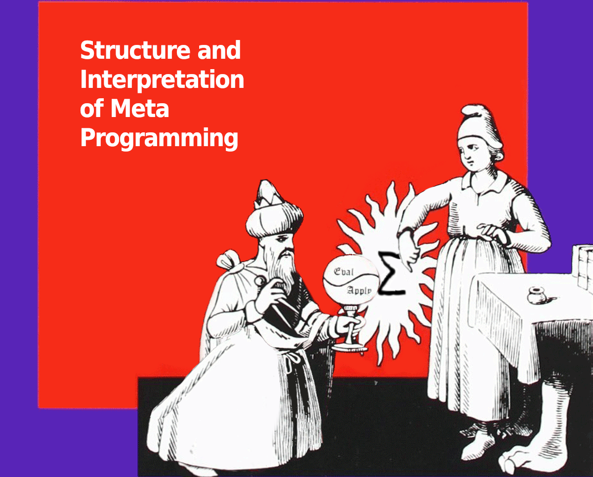

# Simp: A Simplistic Programming Language



Simp is my attempt to design and implement a minimalist lisp language.
Garbage collection and tail-call optimization are implemented.
See `./simp.1` for documentation.

TODO:
* Add quasi-quote and unquote.
* Display the line number and file of error.
* Multiple values?
* Arbitrary precision arithmetic.
* Move exception system into `eval.c`.
* Move repl loop into `eval.c`.

Example:

```
(define ackermann
  (lambda (x y)
    (do
      (display (apply string \('a' 'b' 'c')))
      (newline)
      (if (= y 0) 0
          (= x 0) (* 2 y)
          (= y 1) 2
          (ackermann
            (- x 1)
            (ackermann x (- y 1)))))))

(display
  (ackermann 1 6))
```

The first expression defines the ackermann function; the second
expression computes the ackermann function applied to 1 and 6.

The following can be observed:

* The quotins syntactic sugar is expressed with a backslash rather than
  with a apostrophe, like in scheme.  Apostrophes are used to represent
  bytes and literal characters, like in C.

* There is no `defun` form or a `define` form with embedded lambda.
  Defining a procedure must be done with both `define` and `lambda`
  forms.

* The `lambda` form does not get a sequence of expressions as body.  It
  gets a single expression as body.  To evaluate to a sequence, use the
  `do` form as body.

* There is no `cond` form. The `if` form is the same as scheme's `cond`
  but with less parentheses.

* There are no pairs.  S-expressions are not implemented as singly
  linked lists of cons cells, but as tuples/vectors.
